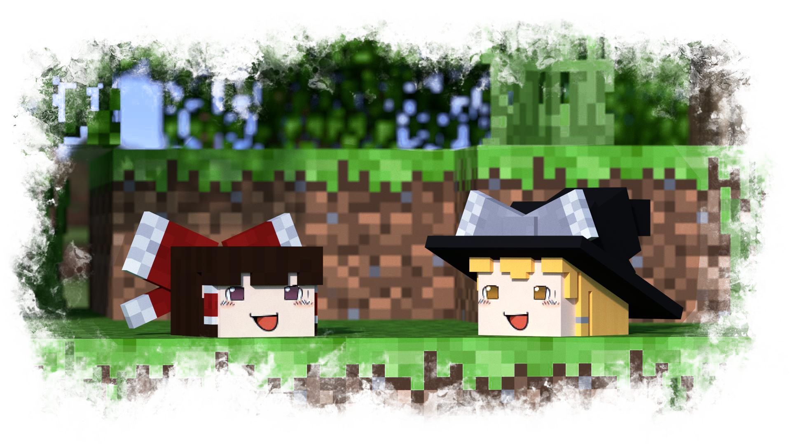

> [!NOTE]
> I don't plan on updating to newer version until all feature set are complete.

<strong>Yukkuri in Minecraft</strong>

This mod add various Touhou Project Yukkuris into Minecraft. For the Uninitiated, a Yukkuri is a seemingly magical construct in the Touhou Universe, devised by the Touhou Project Fandom, consisting of a disembodied head that is somehow able to move around, speak, and perform other activities, depsite the fact that they are only heads. There are different species of Yukkuri, at least one for each Touhou Character (A Lot), and each contain a unique bean paste filling. Whatever they eat magically turns into their bean paste. Their catchphrase is "Take it Easy", and so, a Yukkuri's only goal in life is to take it easy.

___
## Info
- Current version: 1.19.2
- Requires **[Fabric API](https://fabricmc.net/)** and **[GeckoLib](https://geckolib.com/)** to take it easy.

## Credits
- This mod would not be possible without the original [Yukkuri Resource Pack](https://www.minecraftforum.net/forums/mapping-and-modding-java-edition/resource-packs/2627963-touhou-project-yukkuri-pack). Most of the models and textures belongs to Gilthalion. 
- SFX from various Touhou Animations and from the original game.
- Touhou Project made by ZUN.

And don't forget to Take it Easy!